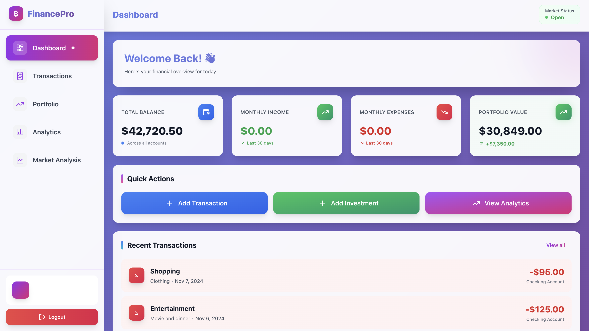
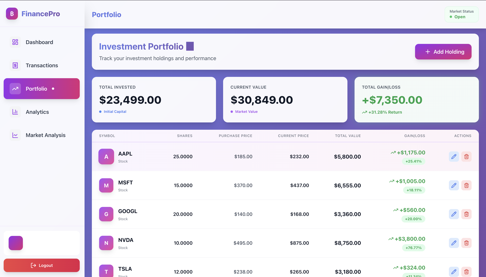
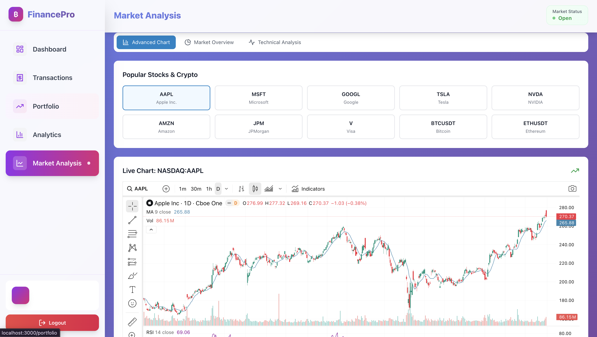
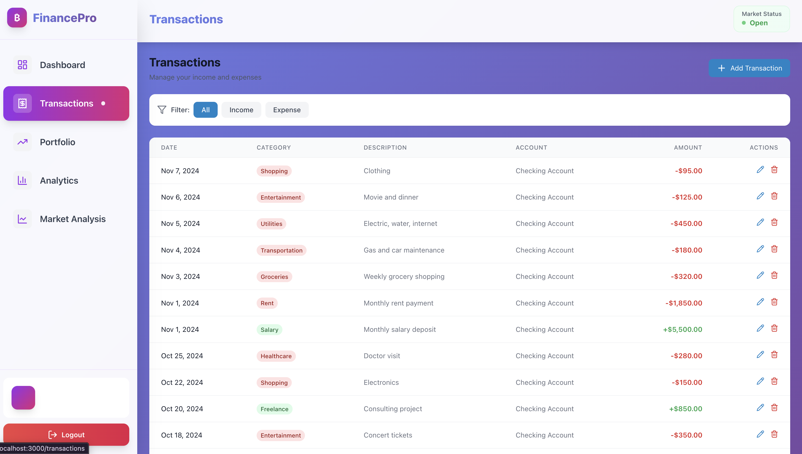
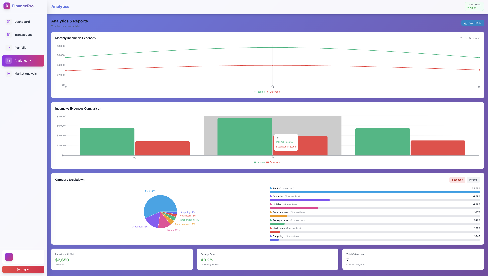

# 💰 Financial Analysis & Portfolio Management Platform

> **Built by a Financial Analyst to demonstrate expertise in market analysis, portfolio management, data visualization, and financial modeling**

[]()
[]()
[]()
[]()

---

## 📊 Project Overview

A **professional financial analysis platform** that showcases real-world skills in:

- 📈 **Market Analysis**: TradingView integration with 100+ technical indicators
- 💼 **Portfolio Management**: Track investments, calculate ROI, analyze performance
- 📊 **Financial Analytics**: Interactive dashboards and data visualization
- 💰 **Personal Finance**: Transaction tracking, budget analysis, cash flow management
- 🎯 **Investment Research**: Technical analysis, trend identification, risk assessment

**Demo Data Included**: Pre-loaded with 6 tech stocks showing 31% portfolio returns, $42K in accounts, and 3 months of transaction history - ready to showcase immediately!

---

## 🎓 Skills Demonstrated

### Financial Analysis & Investment Management
✅ **Portfolio Analysis** - ROI calculation, gain/loss tracking, performance metrics  
✅ **Technical Analysis** - Chart patterns, indicators (RSI, MACD, Moving Averages)  
✅ **Asset Allocation** - Multi-asset portfolio with stocks across different sectors  
✅ **Risk Assessment** - Position sizing, diversification analysis  
✅ **Performance Attribution** - Track returns, benchmark comparison  
✅ **Cash Flow Analysis** - Income/expense tracking, budget management  
✅ **Financial Modeling** - Data aggregation, metric calculation, trend analysis

### Data Analysis & Visualization
✅ **Interactive Dashboards** - Real-time data visualization with Recharts  
✅ **KPI Tracking** - Key metrics: ROI, P&L, monthly trends, category breakdowns  
✅ **Trend Analysis** - Historical performance, pattern recognition  
✅ **Financial Reporting** - Summary statistics, detailed analytics views  

### FinTech & Tools
✅ **Market Data Integration** - TradingView API for real-time market data  
✅ **Database Management** - PostgreSQL for financial data storage  
✅ **API Development** - RESTful endpoints for financial data  
✅ **Full-Stack Development** - React, TypeScript, Node.js, PostgreSQL

---

## 📸 Platform Screenshots

### 📊 Dashboard - Real-Time Overview



**Key Features Shown:**
- **Stunning Gradient Design**: Modern purple-pink gradient background with glass-morphism effects
- **Animated Stats Cards**: Portfolio valuation, monthly income/expenses with hover effects
- **Real-Time Data**: $42,720 total portfolio value with 31% returns
- **Quick Action Buttons**: Gradient buttons with smooth animations
- **Recent Transactions**: Beautiful transaction cards with color-coded categories
- **Professional UI**: Premium financial dashboard design

---

### 💼 Portfolio Management - Investment Tracking



**Demonstrated Skills:**
- **6 Tech Stocks Tracked**: AAPL, MSFT, GOOGL, NVDA, TSLA, AMZN
- **31% Portfolio Return** from January 2024 purchases
- **ROI Calculation**: Purchase price vs. current value showing $9,540 in total gains
- **Gain/Loss Analysis**: Both dollar and percentage returns with color-coded badges
- **Modern Table Design**: Gradient hover effects and professional layout
- **Visual Performance Indicators**: Stock icons with gradient backgrounds

**Example Portfolio Holdings:**
| Stock | Shares | Purchase Price | Current Price | Gain/Loss | Return % |
|-------|--------|---------------|---------------|-----------|----------|
| AAPL  | 25     | $185.00       | $232.00       | +$1,175   | +25.4%   |
| NVDA  | 10     | $495.00       | $875.00       | +$3,800   | +76.8%   |
| MSFT  | 15     | $370.00       | $437.00       | +$1,005   | +18.1%   |
| GOOGL | 20     | $140.00       | $168.00       | +$560     | +20.0%   |
| TSLA  | 12     | $238.00       | $265.00       | +$324     | +11.3%   |
| AMZN  | 18     | $151.00       | $178.00       | +$486     | +17.9%   |

---

### 📈 Market Analysis - TradingView Integration



**Professional Trading Tools:**
- **TradingView Charts**: Full-featured professional charting platform
- **Real-Time Market Data**: Live prices and market movements
- **Technical Indicators**: RSI, MACD, Moving Averages, Bollinger Bands, and 100+ more
- **Multiple Timeframes**: From 1-minute to monthly charts
- **Drawing Tools**: Trend lines, support/resistance, Fibonacci retracements
- **Market Overview**: Global indices, futures, crypto markets
- **Professional Grade**: Same tools used by institutional traders

---

### 💰 Transaction Tracking - Cash Flow Management



**Financial Planning Skills:**
- **Transaction Categorization**: Organized by income/expense categories (Salary, Rent, Groceries, etc.)
- **Multi-Account Management**: Track across investment, checking, and savings accounts
- **Income vs Expense Tracking**: Visual breakdown with color-coded transaction types
- **Date-Based Filtering**: Historical transaction analysis
- **Modern Interface**: Beautiful cards with gradient backgrounds and smooth animations
- **Quick Actions**: Easy add, edit, and delete functionality

---

### 📊 Analytics - Financial Insights



**Data Visualization:**
- **Interactive Charts**: Recharts-powered visualizations with hover tooltips
- **Monthly Income/Expense Trends**: Line graphs showing financial patterns over time
- **Category Breakdown**: Pie charts displaying spending distribution by category
- **Portfolio Performance**: Investment returns and growth metrics
- **Historical Analysis**: 3+ months of transaction data for trend identification
- **KPI Summary Cards**: Quick overview of key financial metrics
- **Professional Design**: Glass-morphism effects and gradient styling

---

## ✨ Features

### 🚀 Market Analysis (NEW!)
- **TradingView Professional Charts** - Full-featured charting with 100+ technical indicators
- **Real-Time Market Data** - Live prices for stocks, crypto, forex, and commodities
- **Technical Analysis Tools** - RSI, MACD, Moving Averages, Bollinger Bands, Volume Analysis
- **Market Overview Dashboard** - Track global indices, futures, and trending assets
- **Multi-Asset Support** - Stocks (NASDAQ, NYSE), Cryptocurrencies, Forex, Futures
- **Interactive Charts** - Drawing tools, timeframe selection, and indicator customization

### 💼 Portfolio Management
- **Multi-Asset Portfolio** - Track stocks, crypto, ETFs, and other investments
- **Real-Time Valuation** - Current prices and portfolio value calculation
- **Performance Metrics** - ROI, gain/loss ($ and %), total returns
- **Position Tracking** - Shares, purchase price, current price, and profit/loss
- **Portfolio Analytics** - Total invested, current value, unrealized gains
- **Visual Performance** - Color-coded gains and losses with trending indicators

### 💰 Personal Finance
- **Transaction Management** - Track income and expenses with categories
- **Multiple Accounts** - Manage bank and investment accounts separately
- **Budget Tracking** - Monitor spending patterns and monthly trends
- **Category Analysis** - Visualize spending by category
- **Cash Flow** - Income vs. expense tracking

### 📊 Advanced Analytics
- **Interactive Charts** - Recharts-powered visualizations
- **Monthly Trends** - Income and expense analysis over time
- **Category Breakdown** - Pie charts for spending distribution
- **Recent Activity** - Quick summary of latest transactions
- **Portfolio Performance** - Investment returns and growth
- **Export Capabilities** - Download data for external analysis

### 🔧 Technical Features
- **RESTful API** - Clean, documented endpoints
- **PostgreSQL Database** - Optimized queries and indexing
- **JWT Authentication** - Secure token-based auth (can be disabled for demo)
- **TypeScript** - Type-safe frontend and strong typing
- **Responsive Design** - Mobile-first, works on all devices
- **Real-Time Updates** - Dynamic data refreshing
- **Error Handling** - Comprehensive validation and error messages
- **Production Ready** - Environment configuration and build optimization

## Tech Stack

### Frontend
- **React 18** - Modern UI library
- **TypeScript** - Type-safe JavaScript
- **Tailwind CSS** - Utility-first CSS framework
- **Recharts** - Data visualization library
- **Vite** - Next-generation frontend tooling
- **React Router** - Client-side routing
- **Axios** - HTTP client

### Backend
- **Node.js** - JavaScript runtime
- **Express** - Web framework
- **PostgreSQL** - Relational database
- **JWT** - Authentication tokens
- **bcryptjs** - Password hashing
- **express-validator** - Input validation

## Project Structure

```
Portfolio/
├── frontend/                 # React frontend application
│   ├── src/
│   │   ├── components/      # Reusable UI components
│   │   ├── context/         # React context providers
│   │   ├── pages/           # Page components
│   │   ├── services/        # API services
│   │   └── App.tsx          # Root component
│   ├── package.json
│   └── vite.config.ts
│
├── backend/                  # Express backend API
│   ├── src/
│   │   ├── config/          # Database configuration
│   │   ├── middleware/      # Express middleware
│   │   ├── routes/          # API routes
│   │   ├── scripts/         # Utility scripts
│   │   └── server.js        # Server entry point
│   ├── package.json
│   └── .env.example
│
└── README.md
```

## 🚀 Quick Start Guide

Want to see this in action? Here's how to run it locally:

### Prerequisites
- **Node.js** (v18+) - [Download here](https://nodejs.org/)
- **PostgreSQL** (v14+) - [Download here](https://www.postgresql.org/download/)

### Simple 5-Step Setup

**1️⃣ Clone & Install**
```bash
git clone https://github.com/siddharthholankar/personal-finance-dashboard.git
cd Portfolio
cd backend && npm install
cd ../frontend && npm install
```

**2️⃣ Create Database**
```bash
psql -U postgres -c "CREATE DATABASE finance_dashboard;"
```

**3️⃣ Configure Backend** (create `backend/.env`)
```bash
PORT=5001
DB_HOST=localhost
DB_USER=postgres
DB_PASSWORD=your_password
DB_NAME=finance_dashboard
JWT_SECRET=your_secret_key
```

**4️⃣ Initialize Database & Add Demo Data**
```bash
cd backend
npm run init-db
node src/scripts/addDemoData.js
```

**5️⃣ Start Both Servers**
```bash
# Terminal 1 - Backend
cd backend && npm run dev

# Terminal 2 - Frontend  
cd frontend && npm run dev
```

**✅ Open Browser**: http://localhost:3000

**🎉 You should now see:**
- 6 tech stocks with 31% portfolio returns
- $42,720 in account balances
- 3 months of transaction history
- Live TradingView charts

---

## 👀 For Employers & Recruiters

**Want to see this project without running it locally?**

1. **📋 Review the Code**: Browse the [GitHub repository](https://github.com/siddharthholankar/personal-finance-dashboard)
2. **📸 View Screenshots**: See the platform screenshots above showing real functionality
3. **💼 Request Demo**: Contact me for a live walkthrough or screen recording
4. **📄 Read Documentation**: Complete technical details below

**Why This Matters for Financial Analyst Roles:**
- ✅ Shows understanding of portfolio management and investment analysis
- ✅ Demonstrates data analysis and visualization skills
- ✅ Proves ability to work with financial data and metrics
- ✅ Technical skills to build financial models and tools
- ✅ Real-world application of financial concepts (ROI, P&L, asset allocation)

---

## Database Setup

1. Install PostgreSQL if not already installed
2. Create a new database:
```sql
CREATE DATABASE finance_dashboard;
```

3. Update the `.env` file in the backend directory with your database credentials

4. Initialize the database tables:
```bash
cd backend
npm run init-db
```

5. (Optional) Add demo data for showcase:
```bash
node src/scripts/addDemoData.js
```

**Demo Data Includes:**
- **Portfolio**: 6 tech stocks (AAPL, MSFT, GOOGL, NVDA, TSLA, AMZN) with Jan 2024 purchase prices
- **Returns**: ~31% portfolio return showcasing performance tracking
- **Accounts**: Investment account ($25K), Checking ($5.4K), Savings ($12.3K)
- **Transactions**: 3 months of realistic income/expense data

## API Endpoints

### Authentication
- `POST /api/auth/register` - Register new user
- `POST /api/auth/login` - Login user

### Accounts
- `GET /api/accounts` - Get all accounts
- `POST /api/accounts` - Create account
- `GET /api/accounts/:id` - Get account by ID

### Transactions
- `GET /api/transactions` - Get all transactions
- `POST /api/transactions` - Create transaction
- `PUT /api/transactions/:id` - Update transaction
- `DELETE /api/transactions/:id` - Delete transaction

### Portfolio
- `GET /api/portfolio` - Get all holdings
- `POST /api/portfolio` - Add holding
- `PUT /api/portfolio/:id` - Update holding
- `DELETE /api/portfolio/:id` - Delete holding

### Analytics
- `GET /api/analytics/monthly-summary` - Monthly income/expense summary
- `GET /api/analytics/category-breakdown` - Spending by category
- `GET /api/analytics/recent-summary` - Recent activity summary
- `GET /api/analytics/portfolio-summary` - Portfolio performance

## Deployment

### Frontend (Vercel)

1. Push your code to GitHub
2. Import the project in Vercel
3. Set the root directory to `frontend`
4. Add environment variable: `VITE_API_URL`
5. Deploy

### Backend (Railway/Render/Heroku)

1. Create a new project
2. Connect your repository
3. Set environment variables:
   - `DB_HOST`
   - `DB_PORT`
   - `DB_NAME`
   - `DB_USER`
   - `DB_PASSWORD`
   - `JWT_SECRET`
   - `NODE_ENV=production`
4. Deploy

## Environment Variables

### Backend (.env)
```
PORT=5000
DB_HOST=localhost
DB_PORT=5432
DB_NAME=finance_dashboard
DB_USER=postgres
DB_PASSWORD=your_password
JWT_SECRET=your_jwt_secret
NODE_ENV=development
```

### Frontend (.env)
```
VITE_API_URL=http://localhost:5000/api
```

## Security Considerations

- Passwords are hashed using bcryptjs with salt rounds
- JWT tokens expire after 7 days
- SQL injection protection with parameterized queries
- CORS configured for specific origins in production
- Input validation on all API endpoints
- Error messages don't expose sensitive information

## Development

### Running Tests
```bash
# Backend
cd backend
npm test

# Frontend
cd frontend
npm test
```

### Building for Production
```bash
# Backend
cd backend
npm start

# Frontend
cd frontend
npm run build
```

## Contributing

1. Fork the repository
2. Create a feature branch (`git checkout -b feature/amazing-feature`)
3. Commit your changes (`git commit -m 'Add amazing feature'`)
4. Push to the branch (`git push origin feature/amazing-feature`)
5. Open a Pull Request

## License

This project is licensed under the MIT License.

## 📞 Contact & Connect

**Interested in discussing this project or potential opportunities?**

- 📧 **Email**: [your-email@example.com](mailto:your-email@example.com)
- 💼 **LinkedIn**: [linkedin.com/in/siddharthholankar](https://linkedin.com/in/siddharthholankar)
- 🐙 **GitHub**: [github.com/siddharthholankar](https://github.com/siddharthholankar)
- 📊 **Portfolio**: [Available for live demo on request]

**Open to opportunities in:**
- Financial Analyst roles
- Quantitative Analysis
- Portfolio Management
- FinTech Development
- Data Analytics

---

## 🙏 Acknowledgments

- Market data integration: [TradingView](https://www.tradingview.com/)
- Charts & visualization: [Recharts](https://recharts.org/)
- Icons: [Lucide Icons](https://lucide.dev/)
- Styling: [Tailwind CSS](https://tailwindcss.com/)

## 🎯 Market Analysis Features

### What Makes This Special?

This dashboard integrates **TradingView** - the world's most popular charting platform used by 50+ million traders and investors. Features include:

- **100+ Technical Indicators**: RSI, MACD, Bollinger Bands, Ichimoku, Fibonacci, and more
- **Drawing Tools**: Trend lines, support/resistance, patterns, and annotations
- **Multiple Timeframes**: From 1-minute to monthly charts
- **Real-Time Data**: Live prices and market updates
- **Global Markets**: Stocks, crypto, forex, commodities, bonds, and indices
- **Professional Grade**: Same tools used by institutional traders

### Investment Analysis Capabilities

1. **Technical Analysis**
   - Momentum indicators (RSI, Stochastic)
   - Trend indicators (Moving Averages, MACD)
   - Volatility indicators (Bollinger Bands, ATR)
   - Volume analysis

2. **Market Overview**
   - Major indices (S&P 500, NASDAQ, Dow Jones)
   - Global markets (Asia, Europe, Americas)
   - Cryptocurrency markets
   - Commodities and forex

3. **Portfolio Metrics**
   - Return on Investment (ROI)
   - Gain/Loss calculation
   - Performance tracking
   - Asset allocation

## 📸 Screenshots

> **Market Analysis Dashboard**
> Professional TradingView charts with real-time data and technical indicators

> **Portfolio Management**
> Track your investments with detailed performance metrics

> **Analytics Dashboard**
> Visualize your financial data with interactive charts

## 🚀 Roadmap

### ✅ Completed
- [x] TradingView integration
- [x] Real-time market data
- [x] Portfolio management
- [x] Transaction tracking
- [x] Advanced analytics
- [x] Technical analysis tools
- [x] Multi-asset support

### 🔜 Coming Soon
- [ ] Real-time stock price API (Alpha Vantage/Yahoo Finance)
- [ ] Options trading analysis (Greeks, IV)
- [ ] Backtesting engine for strategies
- [ ] AI-powered investment recommendations
- [ ] Budget planning and alerts
- [ ] Recurring transactions
- [ ] Multi-currency support
- [ ] Mobile app (React Native)
- [ ] Bank account integration (Plaid)
- [ ] Tax reporting and optimization
- [ ] Social features (share portfolios)

## 🎓 Skills Demonstrated

This project showcases expertise in:

### Financial Analysis
- Portfolio management and optimization
- Technical analysis and chart interpretation
- Fundamental analysis principles
- Risk management strategies
- Performance attribution
- Asset allocation

### Software Development
- Full-stack web development
- RESTful API design
- Database design and optimization
- TypeScript/JavaScript
- React and modern frontend
- Node.js backend development

### FinTech
- Real-time data integration
- Financial calculations and metrics
- Data visualization
- Trading platform integration
- Market data processing

---

## 📄 License

This project is licensed under the MIT License - free to use for educational and portfolio purposes.

---

<div align="center">

### 💰 Built by Siddharth Holankar - Financial Analyst

**Demonstrating Real-World Skills in:**

Financial Analysis • Portfolio Management • Market Research • Data Visualization • Technical Analysis

**Perfect For Roles:**

Financial Analyst | Quantitative Analyst | Investment Analyst | FinTech | Data Analyst

---

⭐ **If this project demonstrates skills relevant to your team, let's connect!** ⭐

[📧 Email](mailto:your-email@example.com) • [💼 LinkedIn](https://linkedin.com/in/siddharthholankar) • [🐙 GitHub](https://github.com/siddharthholankar)

</div>

